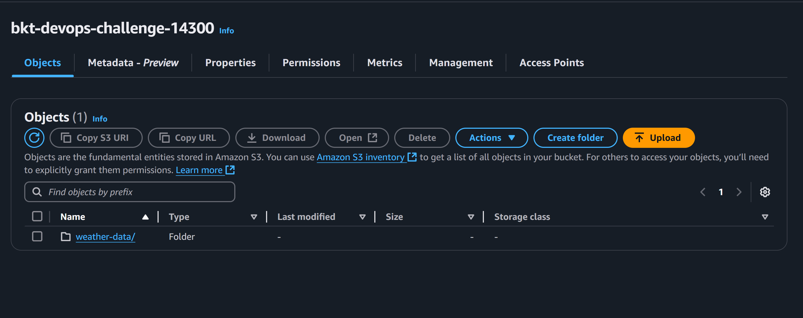
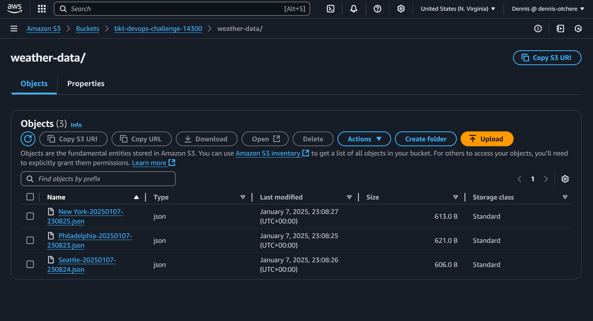

# 30-Days DevOps Challenge - Weather Dashboard (Day 1)

This project is a Python script that collects real-time weather data from the OpenWeather API and stores it in AWS S3. It's designed with DevOps best practices in mind, including infrastructure as code, version control, and robust error handling. The system can track weather conditions (temperature, humidity, etc.) for multiple cities and automatically archives the data in the cloud for further analysis.

## Prerequisites

- Python 3.x
- AWS account with S3 access
- OpenWeather API key
- AWS CLI config

## Installation

1. Clone the repository:
    ```sh
    git clone weather-dashboard-demo
    cd weather-dashboard-demo
    ```

2. Install the required Python packages:
    ```sh
    pip install -r requirements.txt
    ```

3. Set up your environment variables:
    - Create a [.env](./.env) file in the root directory of the project.
    - Add your OpenWeather API key and AWS S3 bucket name to the [.env](./.env) file:
        ```env
        OPENWEATHER_API_KEY=your_openweather_api_key
        AWS_BUCKET_NAME=your_s3_bucket_name
        ```

      
## Project Directory Structure

```markdown
.env
.gitignore
data/
README.md
requirements.txt
src/
    __init__.py
    weather_dashboard.py
tests/
```

## Usage

To run the Weather Dashboard, execute the following command:
```sh
python src/weather_dashboard.py
```
OR
```sh
python3 src/weather_dashboard.py
```

### 💡[weather_dashboard.py](./src/weather_dashboard.py): Main script for fetching and saving weather data.
### 💡[requirements.txt](./requirements.txt): List of required Python packages.
### 💡[.env](./.env): Environment variables file (not included in version control).

#
# Result
Bucket created


API Data received successfully as a JSON file


# License
This project is licensed under the [MIT License](./LICENSE).

